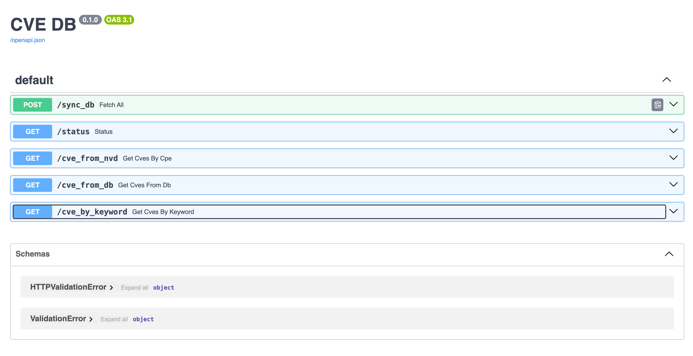

# 🛡️ Vulnerability Scanner – CVE Database Sync & Search
## 🚀 How to Run
```
docker compose up -d --build
```
Once running, the API is available at:
📍 http://localhost:8000

<p align="center">  </p>

### Stack Used
 - GitHub Actions (Integrated Black formatter in CI)
 - PostgreSQL @15
 - FastAPI
 - NVD API(National Vulnerabilities API)
 - Docker compose
 - Black foramtter
 - Chunks Data Loading
## 📘 API Usage Guide
### 🔄 Sync Local DB with Official NVD
Send a POST request to the /sync endpoint.
It will fetch CVEs from the official NVD API in chunks (default chunk size = 2000).

### 📊 Check Sync Status
`GET /status`
Returns how many CVEs are currently stored in your local DB.

### 🌐 Fetch CVE from Official NVD API
`GET /cve_from_nvd?cve_id=<CVE-ID>`
Returns CVE data directly from the official API.

### 🗃️ Fetch CVE from Local DB
`GET /cve_from_db?cve_id=<CVE-ID>`
Returns locally stored CVE data.

### 🔍 Search CVEs by Keyword
`GET /cve_by_keyword?keywordSearch=<keyword>`

Looks in the local database first.

If no results are found, fetches from the official NVD API.

Keyword is searched within the description.

## 📦 Example Response
```
[
  {
    "cve_id": "CVE-2019-1010218",
    "cpe_name": "cpe:2.3:a:cherokee-project:cherokee_web_server:*:*:*:*:*:*:*:*",
    "fetched_at": "2025-05-06T23:39:54.809",
    "description": "Cherokee Webserver ... The fixed version is: There's no fix yet.",
    "metrics": [
      {
        "source": "nvd@nist.gov",
        "type": "Primary",
        "cvssData": {
          "version": "2.0",
          "vectorString": "AV:N/AC:L/Au:N/C:N/I:N/A:P",
          "baseScore": 5
        },
        "baseSeverity": "MEDIUM",
        "exploitabilityScore": 10,
        "impactScore": 2.9
      }
    ]
  }
]
```
## 📁 Project Structure Highlights
`.env`: Configuration for database and API keys

`Dockerfile`: Builds the FastAPI service

`docker-compose.yml`: Orchestrates the full stack

`routes/`: Contains API route handlers

`db/`: PostgreSQL connection setup

`utils/logger.py`: Custom logging for debug and errors


